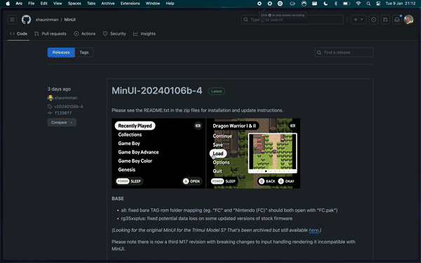
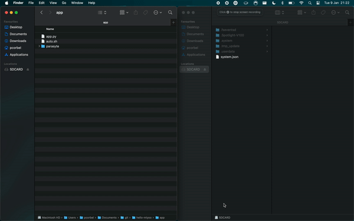

# hello-miyoo

A hello-world for the Miyoo Mini 👋

## 📦 Install MinUI

* Download the latest `base` release of [MinUI](https://github.com/shauninman/MinUI/releases) and unzip it.
* Copy the "miyoo" folder and "MinUI.zip" (without unzipping) to the root of the SD card.
* Insert the SD card into the Miyoo and start it.

## ✅ Setup the hello-miyoo app

Once you have successfully installed MinUI, you can now install the hello-miyoo app.

* On the SD card, copy the `app` folder content (should be `app.py`, `auto.sh` and `parasyte` folder) in the `/.userdata/miyoomini/` folder.

* Start your Miyoo, and voilà !

## 🤔 How is it working?

The `auto.sh` script is executed by MinUI at startup time. It will load all necessary libraries from Parasyte, then will execute the `app.py` file, which is a Python script using the PyGame library.

You can now create your own apps using Python and PyGame, and share them with the community !

## 🥇 Credits

| Name     | Description                                                                                                                                                                 | Source                                                         | Author                        |
|----------|-----------------------------------------------------------------------------------------------------------------------------------------------------------------------------|----------------------------------------------------------------|-------------------------------|
| MinUI    | A custom launcher and libretro frontend for the RGB30, M17 (early revs), Trimui Smart (and Pro), Miyoo Mini (and Plus), and Anbernic RG35XX (and Plus) with more to come... | https://github.com/shauninman/MinUI/                           | https://github.com/shauninman |
| Parasyte | Parasyte is a compatibility layer for Miyoo Mini apps.                                                                                                                      | https://github.com/steward-fu/archives/releases/tag/miyoo-mini | https://github.com/steward-fu |
| PyGame   | Pygame is a free and open-source cross-platform library for the development of multimedia applications like video games using Python.                                       | https://github.com/pygame/pygame                               | https://github.com/pygame     |
